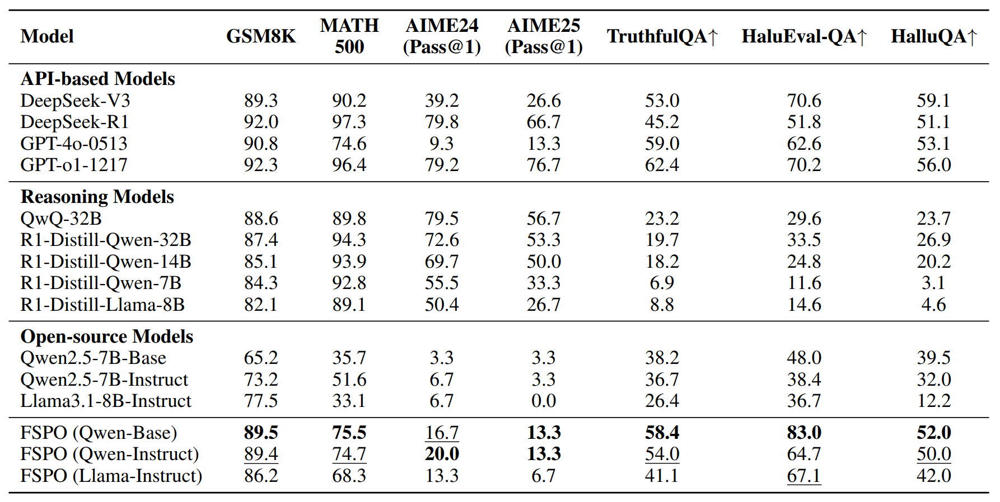
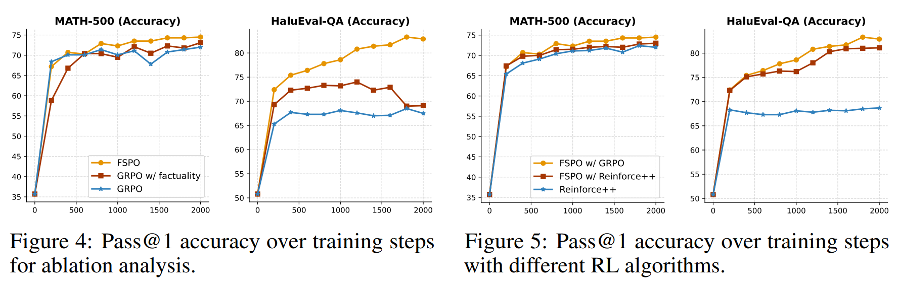
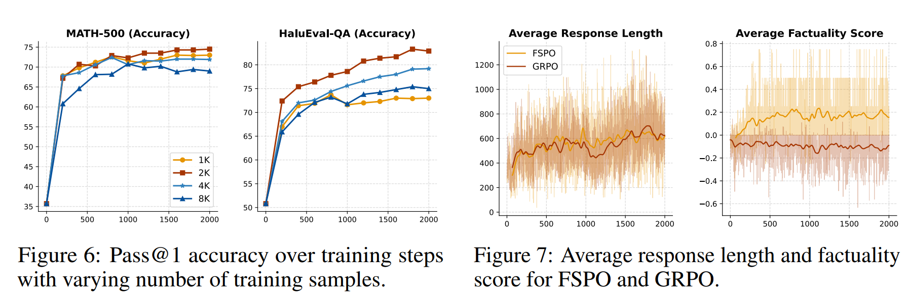

<div align='center'>
<h1>The Hallucination Dilemma: Factuality-Aware Reinforcement Learning for Large Reasoning Models</h1>

<!-- TODO:  Thread,Paper,Dataset,Weights-->
[](https://www.arxiv.org/pdf/2505.24630)
[]()
[]()
</div>

> [!IMPORTANT]
> **🔥 News!!!**
> - [2025/06/02] We release our code, data for reproducing our work.
> - [2025/05/30] We release our paper "The Hallucination Dilemma: Factuality-Aware Reinforcement Learning for Large Reasoning Models" on arXiv.

We propose **F**actuality-aware **S**tep-wise **P**olicy **O**ptimization (**FSPO**), an innovative RL fine-tuning algorithm incorporating explicit factuality verification at each reasoning step. FSPO leverages automated verification against given evidence to dynamically adjust token-level advantage values, incentivizing factual correctness throughout the reasoning process. Our algorithm is based on the awesome [verl](https://github.com/volcengine/verl) framework. Thanks for their great work!

## Key Results

### Reasoning and Factuality Performance

🚀 On hallucination benchmarks, FSPO clearly outperforms all open-source, reasoning and even some API-based models. On reasoning benchmarks, FSPO achieves superior results within the open-source category, notably surpassing other base models like Qwen2.5-7B-Instruct and Llama3.1-8B-Instruct by significant margins (e.g., GSM8K 89.5% vs. 73.2% and 77.5%, respectively).



### Ablation and Generalization



### Number of Samples and Factuality Improvement



## Reproducibility

To benefit the broader research community, we fully open-source the recipe of our RL training, including algorithm details, dataset, and infrastructures.

### Environment Setup

We recommend using conda to setup the environment:

```bash
conda create -n fspo python=3.10
conda activate fspo
pip3 install -r requirements.txt
```

### Datasets
We provide the post-processed training and evaluation datasets for FSPO at the [data](https://github.com/turboLJY/FSPO/tree/master/data) directory.

If you want to process the original datasets by yourself, you can first download the SimpleRL dataset (~8K) from [simpleRL-reason](https://github.com/hkust-nlp/simpleRL-reason) and the challenging HotpotQA subset (~2K) from [R1-Searcher](https://github.com/RUCAIBox/R1-Searcher) as our raw training dataset. Then, you can run ```math_dataset.py```, ```hotpot.py``` scripts in the directory [examples/data_preprocess](https://github.com/turboLJY/FSPO/tree/master/examples/data_preprocess) to process them. For evaluation, you can download TruthfulQA, HalluQA, HaluEval, GSM8K, MATH-500, AIME2024, AIME2025 from their sources and use the scripts in the directory [examples/data_preprocess](https://github.com/turboLJY/FSPO/tree/master/examples/data_preprocess) to process them.

### Training

The core code relevant to our algortihm lies in line 150-152 in ```ray_trainer.py``` to adjust the token advantage values:

```python
sentence_mask = data.batch['sentence_mask']
flip_mask = (sentence_mask * advantages) >= 0.0
advantages = torch.where(flip_mask, advantages, -advantages)
```

To run the training based on different models, you can run the following command:

```bash
bash main_grpo_qwen_base.sh
bash main_grpo_qwen_instruct.sh
bash main_grpo_llama_instruct.sh
```

### Inference

Since verl stores the model weights in shard checkpoints, I provide the following code to combine them for inference:

```python
def load_sharded_model(fsdp_checkpoint_path):
    state_dict = defaultdict(list)
    checkpoint_dir = Path(fsdp_checkpoint_path)

    shard_files = list(checkpoint_dir.glob("model_world_size_*_rank_*.pt"))
    if not shard_files:
        raise ValueError(f"No checkpoint files found in {fsdp_checkpoint_path}")

    pattern = re.compile(r"model_world_size_(\d+)_rank_(\d+)\.pt")
    world_sizes = set()
    for file in shard_files:
        match = pattern.match(file.name)
        if match:
            world_sizes.add(int(match.group(1)))

    if len(world_sizes) != 1:
        raise ValueError(
            f"Inconsistent world_size found in checkpoint files: {world_sizes}"
        )

    world_size = world_sizes.pop()
    print(f"Found checkpoints with world_size = {world_size}")

    for rank in range(world_size):
        filepath = checkpoint_dir / f"model_world_size_{world_size}_rank_{rank}.pt"
        if not filepath.exists():
            raise ValueError(f"Missing shard file: {filepath}")

        print(f"Loading shard: {filepath}")
        shard_dict = torch.load(filepath, weights_only=False)

        for key, value in shard_dict.items():
            if hasattr(value, "to_local"):
                value = value.to_local()
            state_dict[key].append(value)

    consolidated_state_dict = {}
    for key in state_dict:
        try:
            consolidated_state_dict[key] = torch.cat(state_dict[key], dim=0)
        except (RuntimeError, TypeError):
            consolidated_state_dict[key] = state_dict[key][0]
            print(
                f"Parameter '{key}' does not need concatenation, using first shard value"
            )

    return consolidated_state_dict


def initialize_model_and_tokenizer(local_path, trust_remote_code=True, torch_dtype=torch.bfloat16):
    tokenizer = hf_tokenizer(local_path, trust_remote_code=trust_remote_code)

    actor_model_config = AutoConfig.from_pretrained(local_path, trust_remote_code=trust_remote_code)
    actor_module = AutoModelForCausalLM.from_pretrained(
        pretrained_model_name_or_path=local_path,
        torch_dtype=torch_dtype,
        config=actor_model_config,
        attn_implementation="flash_attention_2",
        trust_remote_code=trust_remote_code,
    )

    return tokenizer, actor_module

tokenizer, model = initialize_model_and_tokenizer(args.base_model_path)
state_dict = load_sharded_model(args.shared_ckpt_path)
model.load_state_dict(state_dict)
model.to(torch.bfloat16)
model.to(device)
```

You can run the scripts in [/evaluate]() directory to conduct inference. For example, 

```bash
eval_truthfulqa.sh
```

## Acknowledgement and Citation

We thank the [verl](https://github.com/volcengine/verl) for providing the awesome open-source RL infrastructure.

If you use the data or code in this repo, please cite the following paper:

```
@inproceedings{FSPO,
  author = {Junyi Li and Hwee Tou Ng},
  title = {The Hallucination Dilemma: Factuality-Aware Reinforcement Learning for Large Reasoning Models},
  year = {2025},
  eprint={2505.24630},
  archivePrefix={arXiv},
  primaryClass={cs.CL},
  url={https://arxiv.org/abs/2505.24630}, 
}
```
